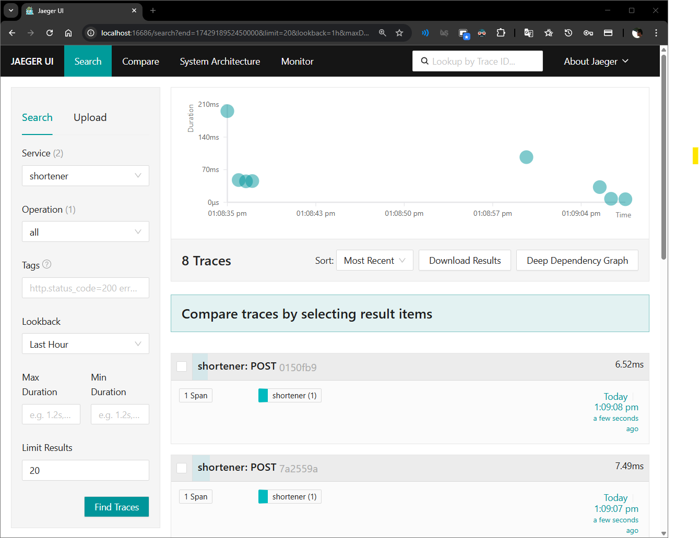
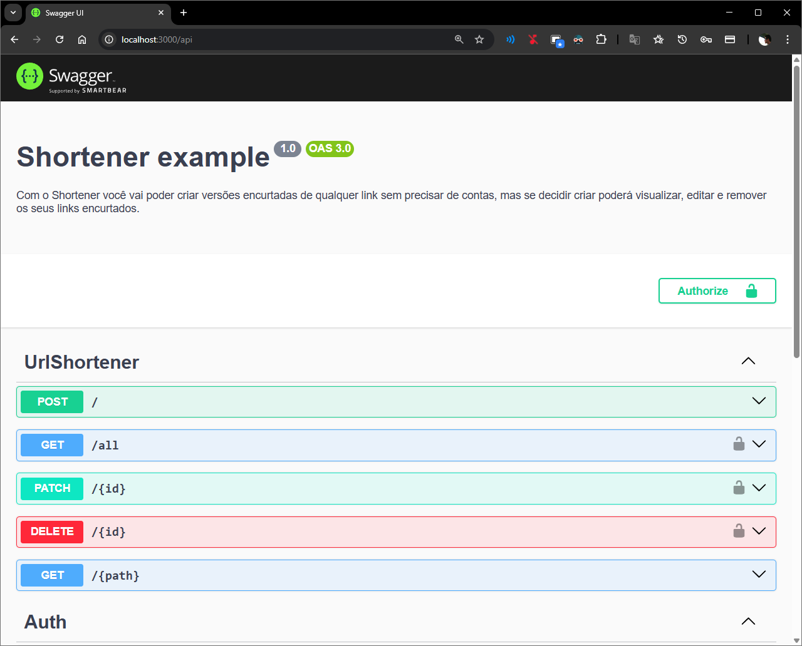

# Shortener

Torne seus links mais fáceis de serem compartilhados.

## Descrição

Com o Shortener você vai poder criar versões encurtadas de qualquer link sem precisar de
contas, mas se decidir criar poderá visualizar, editar e remover os seus links encurtados.

## Tecnologias

* Nest.js
  * bcrypt
  * class-validator
  * typeorm
* Postgres
* Docker
* Jaeger

## Preparação do projeto

Primeiro baixe o repositório:

```bash
git clone https://github.com/jos3s/Shortener/
```

Entre na pasta do projeto:

```bash
cd shortener
```

E instale as dependências:

```bash
npm install
```

## Rodar o projeto localmente

```bash
npm run start:dev
```

### Se for rodar o projeto sem utilizar o docker

Recomendo alterar as informações do arquivo **constants.ts** para a conexão local com o banco.

Para a observabilidade com o Jaeger pode ser necessário subir um container docker com o a ferramenta, utilize o comando a seguir para isso:

```bash
docker run -d --name jaeger \
  -e COLLECTOR_ZIPKIN_HOST_PORT=:9411 \
  -e COLLECTOR_OTLP_ENABLED=true \
  -p 6831:6831/udp \
  -p 6832:6832/udp \
  -p 5778:5778 \
  -p 16686:16686 \
  -p 4317:4317 \
  -p 4318:4318 \
  -p 14250:14250 \
  -p 14268:14268 \
  -p 14269:14269 \
  -p 9411:9411 \
  jaegertracing/all-in-one:1.41
```

## Rodar o projeto com docker

```bash
docker compose up --build
```

### Pontos de acesso

#### PgAdmin

Subindo o projeto com o docker, acesse `http://localhost:5050/`, entre com `admin@admin.com` e `pgadmin4`.

Configure um novo servidor, com:

* Host name/address: db
* Port: 5432
* Maintenance database: postgres
* Username: postgres
* Password: postgres

#### Jaeger UI

Acesse `http://localhost:16686/` e busque pelo serviço `shortener`



## Swagger

Acesse o endereço do serviço com '/api' no final e tenha o painel do Swagger com todos os endpoints disponíveis e documentados.



## Pontos de melhorias

* Utilização de variaveis de ambiente
